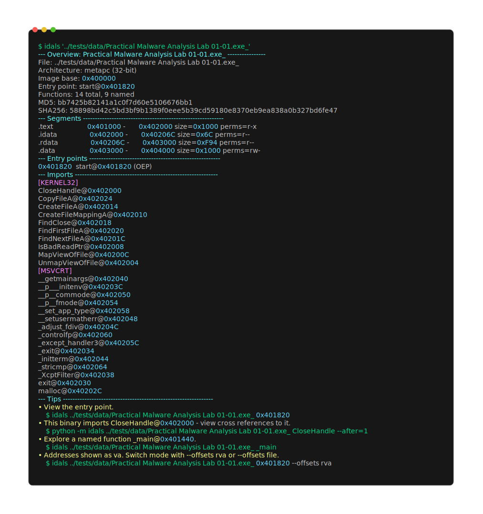
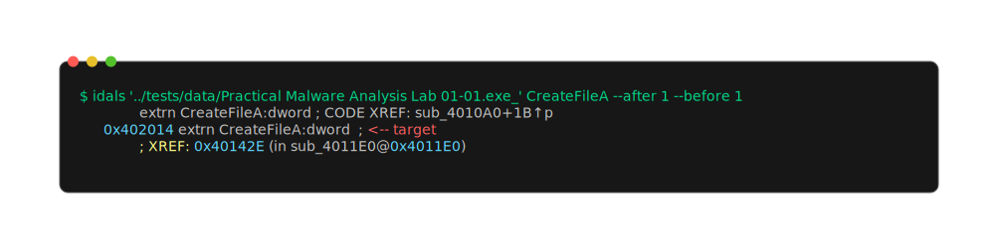
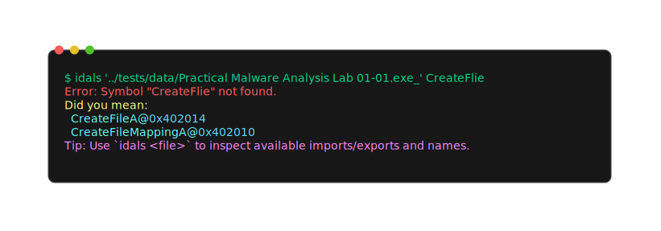

# idals

idals is an IDA Pro-powered command-line tool for binary inspection.

## requirements

- IDA Pro installation
- a usable idapro runtime setup (for example via IDADIR)

## installation

From PyPI:

```bash
pip install idals
```

With uvx.sh:

```bash
curl -LsSf uvx.sh/idals/install.sh | sh
```

Windows:

```powershell
powershell -ExecutionPolicy ByPass -c "irm https://uvx.sh/idals/install.ps1 | iex"
```

Install a pinned version:

```bash
curl -LsSf uvx.sh/idals/0.1.0.dev0/install.sh | sh
```

## usage

```bash
idals --help
idals <file>
idals <file> <address>
```

## examples

These screenshots are generated from the checked-in CLI snapshots in
`tests/snapshots/`. Refresh them with `./scripts/render-readme-examples.sh`
after updating the snapshots.

Binary overview:



Data/import view with xrefs before the item:



Symbol suggestions use `name@0xADDRESS`:


