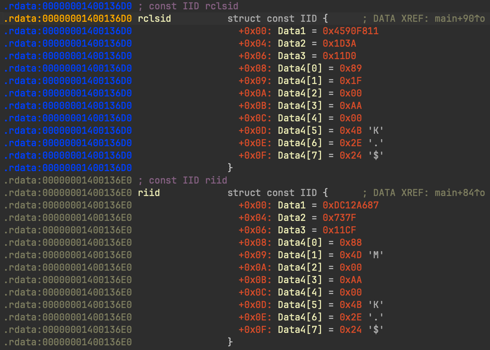
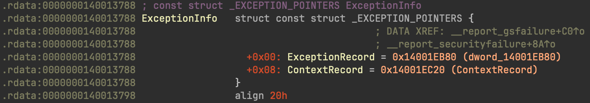
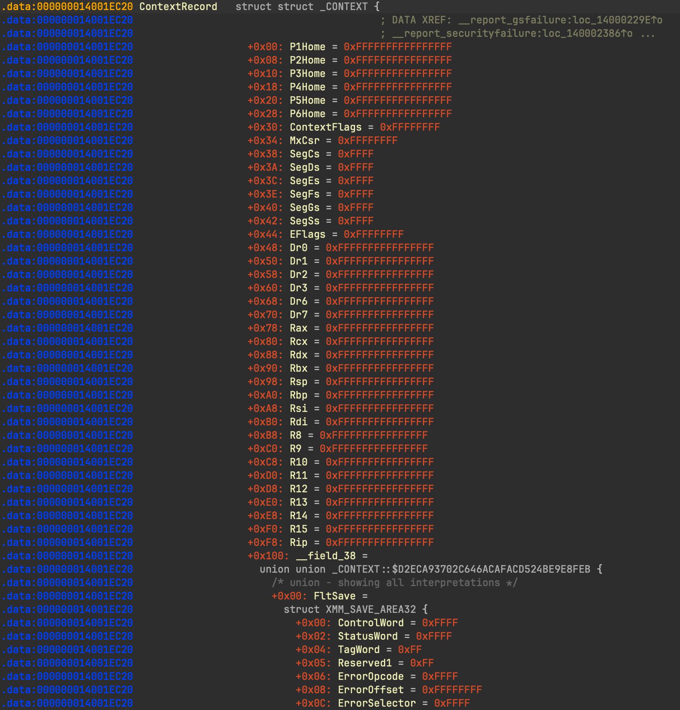

# Global Struct Dissector

Global Struct Dissector is an IDA Pro plugin that renders data in the disassembly view in a clear, readable format with
explicit field names, offsets, and values. The plugin hooks IDA's data rendering system to intercept structure instances in
global data segments and formats them using indentation, color syntax highlighting, and organized field listings.

Install via `hcli plugin install global-struct-dissector`

